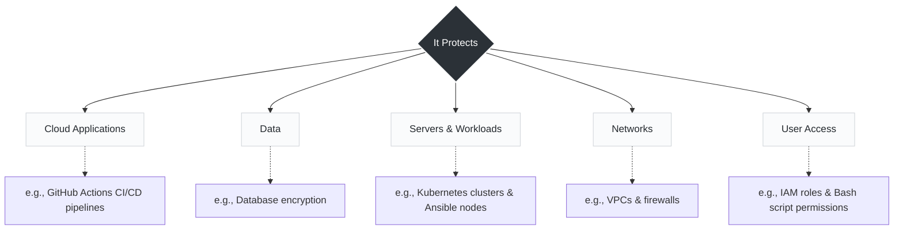

# Day 01

### What is Cloud Security?

Cloud Security is the practice of protecting data, applications, and infrastructure in the cloud from threats and unauthorized access.

**The Five Pillars of Protection:**

1. **Cloud Applications:** Securing the software itself (often where tools like GitHub Actions and automated CI/CD security checks come in).
2. **Data:** Encryption at rest and in transit.
3. **Servers & Workloads:** Securing compute resources, from traditional VMs to Kubernetes clusters.
4. **Networks:** Virtual Private Clouds (VPCs), firewalls, and managing traffic flow.
5. **User Access:** Identity and Access Management (IAM), ensuring only the right people and automated scripts have permissions.



---

**Core Goals:**
Keep cloud environments **secure, available, reliable, and compliant.**
*The right protection ensures business continuity, data privacy, and customer trust.*

---


### The Crucial "Day 1" Concept: The Shared Responsibility Model

As you move deeper into infrastructure automation and SRE, the biggest mindset shift from traditional NOC environments is understanding exactly *who* is responsible for *what*. In the cloud, security is a partnership.

The cloud provider (AWS, Azure, GCP) handles **"Security OF the Cloud."** They protect the physical data centers, the hardware, and the host infrastructure.

You (the customer) handle **"Security IN the Cloud."** Even if you use a provider's database, you are still responsible for configuring the firewall rules correctly, managing the IAM roles, and securing your application code. This is where configuration management tools like Ansible become critical for ensuring security policies are applied consistently across all your environments.

```

----
