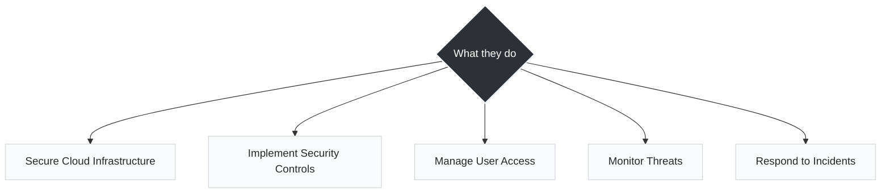
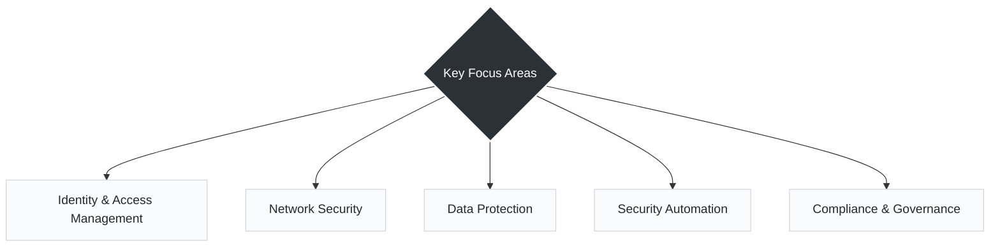

# Day 2

## Who is a Cloud Security Engineer?

* A Cloud Security Engineer is an IT professional who designs, implements, and manages security for cloud environments and applications.

* *Unlike traditional security roles that might focus heavily on physical firewalls or endpoint antivirus, a Cloud Security Engineer treats security as code. They ensure that as environments scale up and down, the security posture scales automatically with them.*

---

### What They Do

What They Do (In Practice)
- **Secure Cloud Infrastructure:** This goes beyond clicking buttons in a dashboard. It involves writing infrastructure code to guarantee that every new environment is secure by design. For example, using configuration management tools like Ansible to enforce security baselines across hundreds of virtual machines, or defining strict security contexts for pods running in a Kubernetes cluster.

- **Implement Security Controls:** Applying rules that dictate what is allowed to happen. This means setting up Web Application Firewalls (WAFs), configuring data encryption protocols, and ensuring that tools are in place to block unauthorized actions.

- **Manage User Access:** Moving away from shared passwords to strict, role-based access. This ensures that a developer only has access to a specific dev namespace, or that an automated service account only has the exact permissions needed to run a specific script.

- **Monitor Threats:** Analyzing logs and metrics to detect anomalies. This draws heavily on network traffic analysis and system monitoring, looking for unusual data exfiltration or unauthorized login attempts.

- **Respond to Incidents:** When an alert fires, engineers must act quickly. Modern incident response relies heavily on automation—triggering Python or Bash scripts to automatically isolate a compromised server, revoke compromised credentials, or parse logs for a rapid post-mortem analysis.

---

### Key Focus Areas

- **Identity & Access Management (IAM):** Often considered the "new perimeter." In the cloud, IP addresses change constantly, so security is anchored to identity. Every person, application, and automation script must authenticate and be authorized before making changes.

- **Network Security:** While traditional routing and switching principles still apply, cloud network security focuses on software-defined networking. This involves architecting secure Virtual Private Clouds (VPCs), configuring granular security groups (cloud firewalls), and ensuring traffic between microservices is encrypted.

- **Data Protection:** Ensuring data is unusable if stolen. This involves managing encryption keys and ensuring data is encrypted both at rest (in databases) and in transit (over the network).

- **Security Automation:** The core of modern DevOps and SRE practices. This means moving away from manual audits. Engineers build security directly into CI/CD pipelines (like GitHub Actions) so that every code commit and infrastructure change is automatically scanned for vulnerabilities before it is deployed.

- **Compliance & Governance:** Translating legal and business requirements (like GDPR or HIPAA) into technical rules. This ensures the organization can prove to auditors that the environment is secure and that policies are actively being enforced.

---
