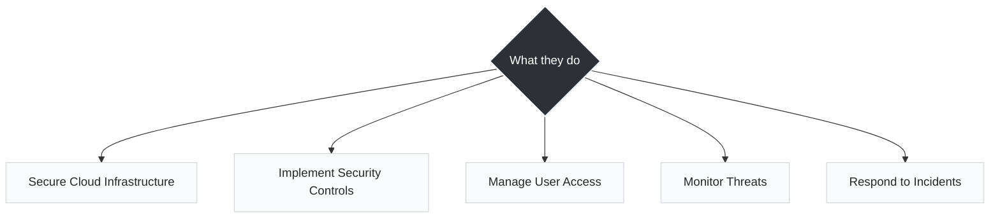
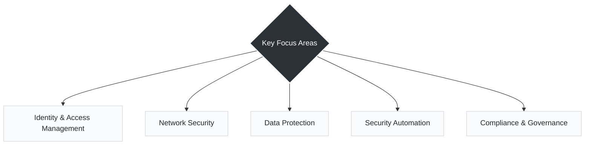

# Day 2

## Who is a Cloud Security Engineer?

* A Cloud Security Engineer is an IT professional who designs, implements, and manages security for cloud environments and applications.

* *Unlike traditional security roles that might focus heavily on physical firewalls or endpoint antivirus, a Cloud Security Engineer treats security as code. They ensure that as environments scale up and down, the security posture scales automatically with them.*

---

### What They Do

---

### Key Focus Areas

