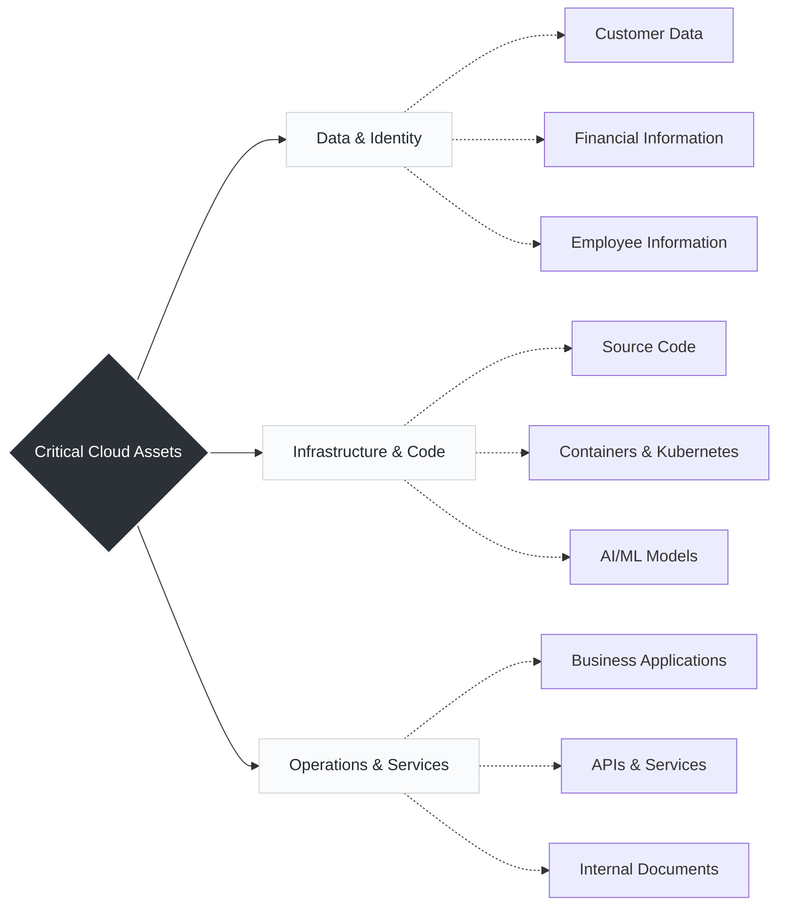

# Day 3: Why Companies Need Cloud Security

Because modern businesses no longer host all their infrastructure in physical on-premise data centers, the "perimeter" has disappeared. Companies now run their most critical, high-value assets entirely in the cloud, making robust security the only thing standing between business operations and catastrophic failure.

---

##  The Critical Assets (What We Protect)

Instead of a flat list, it helps to categorize these assets into how they function within the cloud ecosystem.

*These assets are valuable and must be protected from unauthorized access and cyber threats.*

---

**Breaking Down the Assets:**

* **Infrastructure & Code (The Engine):** Your source code repositories, containerized workloads, and Kubernetes clusters are the blueprints and engines of the company. If an attacker gains access to a CI/CD pipeline or a container orchestration platform, they can inject malicious code or hijack compute resources.
* **Data & Identity (The Crown Jewels):** Customer data, financial records, and employee information are highly regulated. A breach here doesn't just disrupt services; it leads to severe legal consequences.
* **Operations & Services (The Business Logic):** APIs, microservices, and internal documents. APIs are particularly vulnerable because they are the exposed endpoints that allow different systems to talk to each other over the internet.

---

##  Why Security is Essential (The Business Impact)

Security is not just about blocking hackers; it is a core requirement for keeping the business alive and functioning.

-  Prevent Data Breaches
-  Avoid Financial Losses
-  Meet Compliance Requirements
-  Ensure Business Continuity 
-  Build Customer Trust

  ----
  
