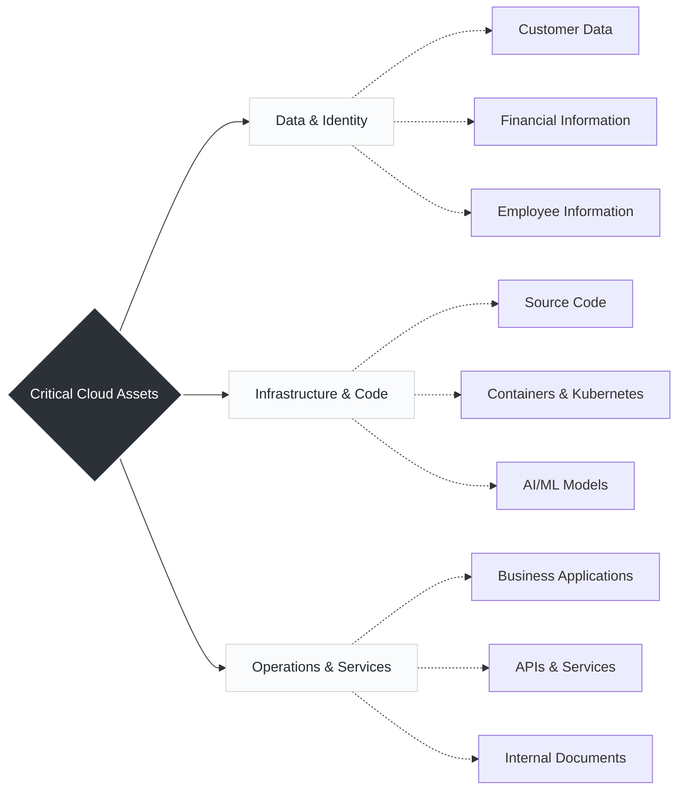

# Day 3: Why Companies Need Cloud Security

Because modern businesses no longer host all their infrastructure in physical on-premise data centers, the "perimeter" has disappeared. Companies now run their most critical, high-value assets entirely in the cloud, making robust security the only thing standing between business operations and catastrophic failure.

---

##  The Critical Assets (What We Protect)

Instead of a flat list, it helps to categorize these assets into how they function within the cloud ecosystem.

##  Why Security is Essential (The Business Impact)

Security is not just about blocking hackers; it is a core requirement for keeping the business alive and functioning.
