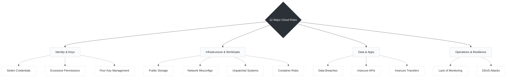

# Day 04: Major Cloud Security Risks

*While the cloud offers immense scalability and operational benefits, it fundamentally changes the threat landscape. Understanding these risks is the first step. The next step is to secure your cloud the right way!*

To make these 12 risks easier to digest and tackle from an engineering perspective, they can be broken down into four core domains:

---

###  1. Identity, Access, & Key Management

Identity is the new perimeter in cloud environments. If attackers can compromise authentication, they bypass network defenses entirely.

* **Stolen Credentials:** Attackers steal usernames, passwords, or access logs. *In modern automation, this often targets hardcoded secrets accidentally left in Bash scripts or Python code.*
* **Excessive Permissions:** Too much access increases the risk of abuse. *Every CI/CD pipeline (like GitHub Actions) and service account must operate on strict least-privilege principles.*
* **Poor Key Management:** Improper key storage or rotation can expose sensitive data.

###  2. Infrastructure & Workloads

This is where configuration management and continuous scanning become critical for maintaining a hardened baseline.

* **Public Storage:** Misconfigured storage can expose data to the public. *Preventable misconfigurations are consistently the most common cause of cloud security incidents, with some research indicating they drive up to 82% of incidents*.
* **Network Misconfigurations:** Wrong network settings can allow unwanted access. *Tools like Ansible are vital here to enforce strict firewall rules and automatically correct configuration drift.*
* **Unpatched Systems:** Missing updates can lead to vulnerabilities. *Vulnerability exploitation is a leading attack vector for initial access, driving 31% of modern breaches*.
* **Container Risks:** Vulnerable images and misconfigurations can compromise containers. *Continuous scanning of Kubernetes pods and registries is required to catch these before deployment.*
