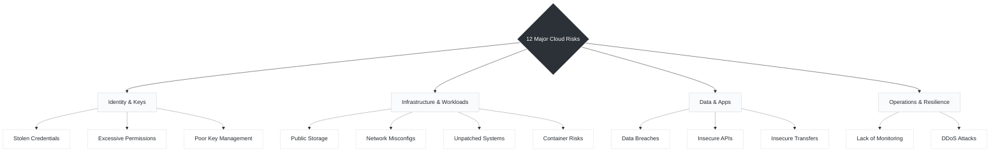

# Day 04: Major Cloud Security Risks

*While the cloud offers immense scalability and operational benefits, it fundamentally changes the threat landscape. Understanding these risks is the first step. The next step is to secure your cloud the right way!*

To make these 12 risks easier to digest and tackle from an engineering perspective, they can be broken down into four core domains:

---

