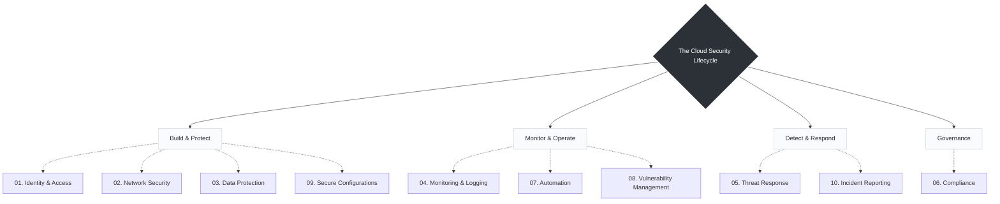

# Day 05: Key Responsibilities of a Cloud Security Engineer

*Cloud Security Engineers work across people, processes, and technology to build secure cloud environments.*

When transitioning from traditional NOC monitoring to a proactive SRE and DevOps mindset, these responsibilities shift from manual audits to continuous, automated engineering tasks.

Here is a structured, expanded version of your notes that maps these 10 responsibilities directly into the daily engineering lifecycle:

---

### The Cloud Security Lifecycle

---
