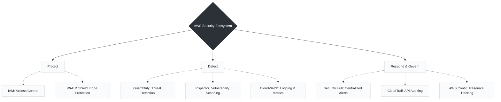

# Day 06: Important Cloud Security Tools

*These native tools form the core AWS ecosystem, working together to help engineers **protect**, **detect**, and **respond** to threats while automating compliance.*

When moving from a traditional network operations view to an automated, scalable infrastructure model, these are the primary services used to enforce policies as code and gain deep visibility into your environments.

---

### The AWS Security Ecosystem

---

###  1. Identity & Network Protection

* **IAM (Identity & Access Management):** Manages user identities, roles, and permissions. Enforcing least privilege access ensures that automated Bash scripts, Python runbooks, or CI/CD workflows only have the exact access required and nothing more.
* **WAF & Shield:** Protects internet-facing web applications from common exploits and scrapers. Shield specifically defends against Distributed Denial of Service (DDoS) threats, ensuring high availability and uptime.

###  2. Threat Detection & Vulnerability Scanning

* **GuardDuty:** Provides intelligent threat detection by continuously monitoring account activity using machine learning and anomaly detection to identify malicious activities. It analyzes billions of events from logs, including VPC Flow Logs and DNS logs.
* **Inspector:** Provides automated vulnerability assessments to test and address publicly known software vulnerabilities on EC2 instances, containers, and applications. This is critical for integrating automated security scans directly into container registries or deployment pipelines.
* **CloudWatch:** Monitors resources, logs, and metrics while allowing engineers to set alarms for real-time insights, shifting operations from reactive troubleshooting to proactive reliability management.

