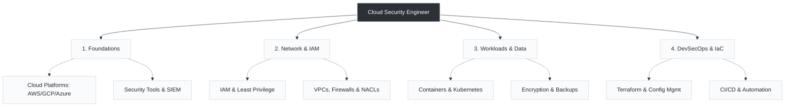

# Day 7: Skills to Become a Cloud Security Engineer

*A mix of cloud knowledge, security concepts, and hands-on tools is essential to secure modern infrastructure.*

Moving from traditional network operations into cloud-native and Site Reliability Engineering roles requires blending existing troubleshooting foundations with heavy automation. The skills below outline the exact path to making that transition successfully.

---

###  The Cloud Security Skill Tree

---

###  The Core Competencies

###  The Path Forward

Mastering these eight domains takes time. However, the extensive logic building done through writing hundreds of Bash scripts, managing robust Python tasks, or configuring infrastructure components manually provides the exact foundation needed to excel at the DevSecOps and IaC stages.

> *Keep learning, practicing in real environments, and stay updated with the latest threats and tools.*
