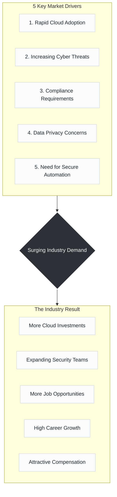

# Day 08: Why Demand for Cloud Security Engineers is Skyrocketing

> *"Companies are moving to the cloud faster than ever, and security is their top priority."*

---

##  The Cause & Effect of Cloud Security Demand

---
