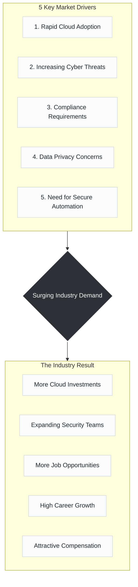

# Day 08: Why Demand for Cloud Security Engineers is Skyrocketing

> *"Companies are moving to the cloud faster than ever, and security is their top priority."*

---

##  The Cause & Effect of Cloud Security Demand

---

##  The 5 Drivers of Demand

* **1. Rapid Cloud Adoption:** Organizations are continuously migrating legacy workloads, applications, and databases to multi-cloud environments, eliminating traditional network boundaries.
* **2. Increasing Cyber Threats:** Attack vectors are multiplying and growing more sophisticated, requiring continuous monitoring, automated incident response, and active threat hunting.
* **3. Compliance Requirements:** Stringent global laws and frameworks (such as GDPR, HIPAA, ISO 27001, and SOC 2) require technical safeguards and demonstrable data protection controls.
* **4. Data Privacy Concerns:** User trust depends on data integrity. Customers expect their sensitive personal and financial data to remain secure, encrypted, and isolated.
* **5. Need for Secure Automation:** High-velocity delivery demands that security scales alongside infrastructure, shifting security checks directly into automated CI/CD pipelines and Infrastructure-as-Code workflows.

---

##  The Result

---

> **Key Takeaway:**
> *Cloud security is not optional anymore. It's a business need and a career booster!*

---
