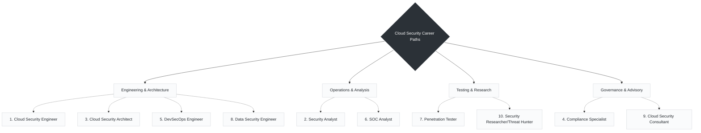

# Day 09 Career Paths for Cloud Security Engineers

> *"Choose a path, keep learning and make the cloud a safer place for everyone!"*

There are many exciting career opportunities in Cloud Security. Depending on whether you prefer writing automation, designing high-level strategy, or actively hunting attackers, there is a role for you.

---

###  Engineering & Architecture (The Builders)

These roles focus on designing, building, and automating security directly into the infrastructure and code.

* **1. Cloud Security Engineer:** Design, implement, and manage secure cloud environments. They bridge the gap between infrastructure and security, often writing the baseline configurations that secure networks, workloads, and identities.
* **3. Cloud Security Architect:** Design secure cloud architectures and high-level security strategies. This is a senior role that creates the "blueprint" for enterprise security, ensuring all measures align with best practices.
* **5. DevSecOps Engineer:** Integrate security into DevOps and CI/CD pipelines. This role is heavily automation-focused, ensuring that code is safe *before* it goes live by embedding security directly into development workflows.
* **8. Data Security Engineer:** Protect data across its lifecycle in the cloud. They focus specifically on encryption (at rest and in transit), key management, and preventing sensitive data exposure.

###  Operations & Analysis (The Defenders)

These roles are the "boots on the ground" responding to alerts and active incidents.

* **2. Security Analyst:** Monitor, detect, and respond to security incidents in the cloud. They investigate suspicious activities (like a spike in failed logins) and execute remediation steps.
* **6. SOC (Security Operations Center) Analyst:** Monitor security events and investigate threats 24/7. They handle the first line of triage when tools like AWS GuardDuty or Security Hub trigger alarms.

###  Testing & Research (The Attackers/Hunters)

These roles take an offensive approach to find vulnerabilities before the bad guys do.

* **7. Penetration Tester:** Test cloud systems for vulnerabilities and exploit risks. They actively try to break into the environment to prove where the weak spots are.
* **10. Security Researcher & Threat Hunter:** Research new threats and proactively hunt for risks. Rather than waiting for an alert to fire, they actively search the environment for hidden attackers or novel vulnerabilities.

