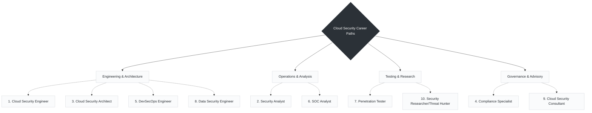

# Day 09 Career Paths for Cloud Security Engineers

> *"Choose a path, keep learning and make the cloud a safer place for everyone!"*

There are many exciting career opportunities in Cloud Security. Depending on whether you prefer writing automation, designing high-level strategy, or actively hunting attackers, there is a role for you.

---

