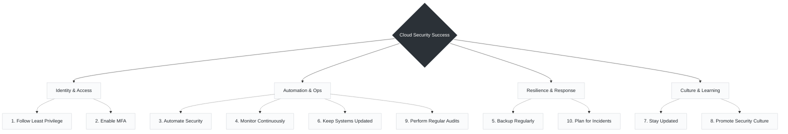

# Day10 : Final Tips for Cloud Security Success

> *"Security is not a product, it's a **process** and a **mindset**."*

Wrapping up this foundational series, these final ten principles highlight the transition from reactive troubleshooting to proactive engineering. Securing a modern environment isn't about buying a single piece of software; it is about building resilient systems from the ground up.

Here is how these ten best practices map onto the daily realities of infrastructure and operations:

---

###  The 10 Pillars of Cloud Security Success

---
