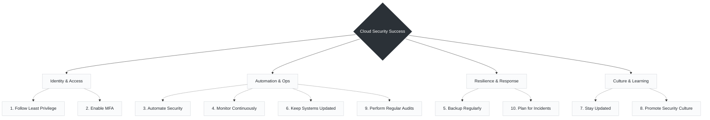

# Day10 : Final Tips for Cloud Security Success

> *"Security is not a product, it's a **process** and a **mindset**."*

Wrapping up this foundational series, these final ten principles highlight the transition from reactive troubleshooting to proactive engineering. Securing a modern environment isn't about buying a single piece of software; it is about building resilient systems from the ground up.

Here is how these ten best practices map onto the daily realities of infrastructure and operations:

---

###  The 10 Pillars of Cloud Security Success

---

###  Best Practices to Follow

** Identity & Access**

* **1. Follow Least Privilege:** Grant only the minimum access required to users and services. This applies not just to human engineers, but to the Python automation tools, Bash scripts, and CI/CD runners interacting with your environment—they should only hold the exact permissions needed for their specific tasks.
* **2. Enable MFA:** Add an extra layer of protection for all user accounts to prevent unauthorized access via compromised passwords.

** Automation & Operations**

* **3. Automate Security:** Use Infrastructure as Code (IaC) and automation to enforce security consistently. Integrating tools like Ansible or embedding security checks into GitHub Actions workflows ensures your secure baselines are deployed uniformly, removing human error.
* **4. Monitor Continuously:** Keep an eye on logs, alerts, and threats 24/7. Centralized logging ensures you have visibility into everything happening across your network.
* **6. Keep Systems Updated:** Patch systems and applications to fix vulnerabilities. Whether it is updating traditional VMs or rotating outdated Kubernetes nodes, continuous patching is critical.
* **9. Perform Regular Audits:** Audit configurations, permissions, and compliance regularly to prevent configuration drift over time.

** Resilience & Response**

* **5. Backup Regularly:** Take regular backups and test recovery processes. A backup is only useful if you have verified that your restoration procedures actually work.
* **10. Plan for Incidents:** Have an incident response plan and test it periodically. When an alert fires, knowing exactly how to isolate a network segment or trigger a remediation script saves crucial minutes.

** Culture & Learning**

* **7. Stay Updated:** Learn new tools, threats, and best practices continuously. The threat landscape evolves rapidly, so continuous education is a core part of the job.
* **8. Promote Security Culture:** Make security everyone's responsibility in the organization. Breaking down the silos between development, operations, and security teams is what truly makes an organization resilient and fast-moving.

---

> **The Ultimate Goal:**
> *Keep learning, keep building, and keep your cloud secure and **resilient**!*

---
